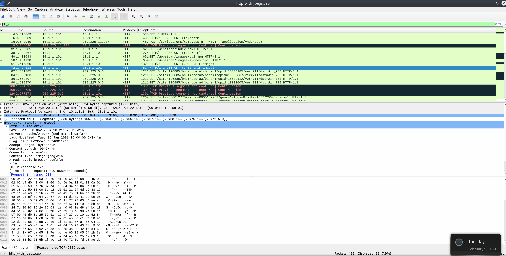

[module walkthrough](https://medium.com/@WriteupsTHM_HTB_CTF/wireshark-hackthebox-intro-to-network-traffic-analysis-2c71bad0d14)


NTA (network traffic analysis)= _looking at the "conversations" happening inside a network_.
**Every attacker must talk to your network.** No matter how stealthy they are, they need to send or receive data. That’s why analyzing traffic helps us detect threats.

### BPF Syntax (Berkeley Packet Filter)

This is like **Google search for packets**.  
You filter packets with conditions so you don’t drown in noise.
Examples:
- `tcp port 80` → only HTTP traffic.
- `host 192.168.1.5` → only packets from/to a specific host.
- `src net 10.0.0.0/24` → only packets from subnet 10.0.0.x.
- `udp and port 53` → DNS queries.

### The NTA Workflow


- **Ingest Traffic** → capture with tcpdump, Wireshark, tap, etc.
- **Reduce Noise** → filter out unnecessary broadcast/multicast.
- **Analyze & Explore** → look for anomalies:
    - Plaintext traffic where encryption is expected.
    - Odd host-to-host communication.
    - Abnormal packet flags (e.g., too many SYNs).
- **Detect & Alert** → decide if it’s malicious or benign. IDS/IPS can help here.
- **Fix & Monitor** → patch or block → keep watching to confirm it’s solved.

---
---

## Networking Primer Layers 1-4


### OSI / TCP-IP Models


### PDU
- Protocol Data Units
- A PDU is a data packet made up of control information and data encapsulated from each layer of the OSI model.


- encapsulation in mind. As our data moves down the protocol stack, each layer will wrap the previous layers' data in a new bubble we call encapsulation. This bubble adds the necessary information of that layer into the header of the PDU.


### MAC addressing

- MAC : media access control address
- It’s a **unique hardware identifier** burned into a network interface card (NIC).
- **Length**: 48 bits = 6 octets = 12 hexadecimal characters.

**`3C:52:82:5A:4B:11`**
- **First 3 octets (3C:52:82)** → **OUI (Organizationally Unique Identifier)** = who made the device (e.g., Intel, Cisco, etc.).
- **Last 3 octets (5A:4B:11)** → **Device Identifier** = unique ID for that NIC.
💡 That means no two NICs should have the same MAC address globally.

- MAC addresses operate at the **Data Link Layer (Layer 2)**.
- Used **inside a local network** (LAN, Wi-Fi).

👉 If you want to send data to another computer on the same LAN
- You use **IP address to know _who_ you want to reach.**
- Then your system asks: _“What’s the MAC address of that IP?”_
- That’s resolved using **ARP (Address Resolution Protocol)**.


red - MAC
blue
green - IPv4

---
### IPv4 (internet protocol address)

- IP = internet protocol address
- Deliver data **from one host to another across networks**.
- Found at **OSI Layer 3 (Network Layer)**.
- Acts like a **postal address** → tells the world _where_ to deliver data.

**features**
- ip just sends packets doesnt guarantee delivery
- no error correction, no acknowledgement retails on higher protocols 

- **Length**: 32 bits → split into 4 octets (8 bits each).
- **Format**: Decimal, dotted notation. Example:
    - `192.168.86.243`
    - Each octet = 0–255.
👉 Why 0–255? Because 1 octet = 8 bits → max value = 11111111 (binary) = 255 (decimal).
Current standard (≈ 4.3 billion addresses total).

---

### IPv6

- **IPv4 exhaustion**: 4.3 billion addresses seemed huge in the 80s, but with phones, laptops, IoT devices → we ran out.
- Attempts to stretch IPv4 life:
    
    - **NAT (Network Address Translation)**
        
    - **CIDR (Classless Inter-Domain Routing)**
        
    - **VLSM (Variable Length Subnet Masking)**

Still not enough → **IPv6 was born**.

- **Length**: 128 bits = **16 octets**
- **Representation**: Hexadecimal, written in 8 groups of 4 hex digits.  
    Example:
    `2001:0db8:85a3:0000:0000:8a2e:0370:7334`
- **Shortened notation**:
    - Remove leading zeros → `2001:db8:85a3::8a2e:370:7334`

👉 Practically: IPv6 = **3.4 × 10³⁸ possible addresses** (almost infinite).  
Every grain of sand on Earth could have its own IP… several times over 🌍.


1. **Huge Address Space**
    - No need for NAT; every device can have a **global unique address**.
2. **Better Multicast Support**
    - Efficiently send data to many hosts at once (e.g., streaming).
3. **Anycast**
    - Same address assigned to multiple servers, but **nearest one replies**.
    - Useful for **load balancing & CDNs** (e.g., Cloudflare, Google DNS).
4. **Integrated Security**
    - IPSec is built into IPv6 standard (in IPv4, it was optional).
5. **Simplified Headers**
    - Easier for routers to process packets quickly.
#### 🔹 IPv6 Address Types

|**Type**|**Meaning**|**Analogy**|
|---|---|---|
|**Unicast**|One-to-one (single device).|Mailing a letter to your friend.|
|**Anycast**|One-to-nearest (group of devices, closest responds).|Calling a pizza chain’s **toll-free number** → you get the nearest branch.|
|**Multicast**|One-to-many (all in the group get it).|Sending a group WhatsApp message.|
|**Broadcast**|❌ Doesn’t exist in IPv6 (replaced by multicast).|N/A — no “shouting to everyone” anymore.|

### Transport Layer

- **Role**: Ensures end-to-end delivery of data between applications.
- **Protocols**: TCP (reliable, connection-oriented), UDP (fast, connectionless).
- **Encapsulation**: Breaks data into segments, adds ports, passes to IP layer.
- **Reassembly**: Reorders segments at destination.

### TCP vs UDP

|**Characteristic**|**TCP**|**UDP**|
|---|---|---|
|Transmission|Connection-oriented|Connectionless (fire-and-forget)|
|Connection Setup|3-way handshake|None|
|Data Delivery|Reliable (sequence + ACKs)|Unreliable (no checks)|
|Speed|Slower (overhead)|Faster (minimal overhead)|
|Best for|SSH, HTTP/S, FTP, Email|DNS, Video/Voice streaming, Gaming|
#### TCP Details
- **Reliable stream**: Tracks sequence numbers + ACKs.
- **Error handling**: Retransmits lost packets.
- **Example**: SSH → safe, complete commands.
- **Handshake (3-way)**:
    - Client → SYN
    - Server → SYN + ACK
    - Client → ACK 
        → Session established.
- **Teardown (graceful close)**:
    - FIN, ACK
    - FIN, ACK
    - ACK  
        → Session terminated.

#### UDP Details

- **Unreliable, fast** → no ACK, no reordering.
- **Best when loss is tolerable** (speed > reliability).
- **Examples**: DNS queries, video streaming, online gaming.

#### TCP Three-way Handshake


#### TCP Session Teardown


---
---

## OSI Layers 5–7 (Application Layer Protocols)

### HTTP
- hypertext transfer protocol
- default -> TCP 80 or 8000
- Transfers webpages, images, videos, etc. between client (browser) and server.

#### HTTP Methods Tables

|**Method**|**Detailed Description**|**Example**|
|---|---|---|
|**HEAD**|Same as GET but only retrieves headers (no body). Used to check if a resource exists or get metadata (size, last modified, etc.).|`HEAD /index.html` → Check if the file exists without downloading it.|
|**GET**|Requests a representation of a resource. Most common method. Safe and idempotent (does not change server data).|`GET /products.html` → Fetches product listing page.|
|**POST**|Submits data to the server to create a new resource or perform an action. Not idempotent (repeating creates duplicates).|`POST /login` with body `{ "user": "Alice", "pass": "123" }` → Log into account.|
|**PUT**|Creates or replaces a resource at the specified URI. Idempotent (repeating gives the same result).|`PUT /users/42` with `{ "name": "Alice" }` → Creates/updates user #42.|
|**DELETE**|Removes the resource at the specified URI. Idempotent (repeat = no effect if already deleted).|`DELETE /users/42` → Deletes user with ID 42.|
|**TRACE**|Echoes back the received request. Used for testing/debugging (rarely enabled due to security risks).|`TRACE /example` → Server returns same request headers.|
|**OPTIONS**|Returns supported HTTP methods for a resource. Helps clients know what actions are allowed.|`OPTIONS /api/users` → Response: `Allow: GET, POST, PUT, DELETE`.|
|**CONNECT**|Converts the request connection into a TCP/IP tunnel. Commonly used to enable HTTPS through proxies.|`CONNECT www.bank.com:443` → Proxy opens a secure tunnel for HTTPS traffic.|

### HTTPS
- HTTP secure
- default -> TCP 443 or 8443
- Encrypts communication (web browsing, banking, login).

#### TLS handshake
TLS (Transport Layer Security) handshake is the **process of two computers (client & server) agreeing on how to securely communicate** before sending actual data.

|#|Communication Between|Description|Analogy|
|---|---|---|---|
|1|**Client → Server**|**ClientHello**: Client proposes supported TLS version, cipher suites (encryption methods), and sends a random value.|You walk into a shop and say: _“I can talk in English or Spanish, which one do you prefer? Here’s a random phrase so our secret code will be unique.”_|
|2|**Server → Client**|**ServerHello**: Server chooses one cipher suite, sends its own random value, and provides its **digital certificate** (signed by a trusted CA).|Shopkeeper replies: _“Let’s use English. Here’s my government-issued ID to prove I’m legit. Also, here’s my random phrase.”_|
|3|**Client ↔ Server**|**Authentication & Key Exchange**: Client verifies the server’s certificate with a CA. Then both exchange key information (RSA or Diffie-Hellman/ECDHE) to generate a **shared secret**.|You check the shopkeeper’s ID against government records. Then you both agree on a secret handshake/code.|
|4|**Client ↔ Server**|**Session Key Creation**: Using both random values + shared secret, they generate the same **symmetric session key** (for fast encryption).|You and the shopkeeper now invent a secret language only both of you can understand.|
|5|**Client ↔ Server**|**Finished Messages**: Both sides confirm that encryption is active and ready. From now on, all communication is **encrypted with the session key**.|You both say: _“Okay, from now on, only secret code!”_ and start talking secretly.|


### FTP
- file transfer protocol 
- layer 7
- TCP 21 (control/command)or TCP 20 (data transfer)
- Insecure (data, including credentials, is sent in plaintext) → replaced by **SFTP** (uses SSH) or **FTPS** (FTP with TLS).
- can require a uname/password or allow anonymous access

#### How FTP Works
- When you connect to an FTP server:
    - **Port 21 (Control Channel):** Used for sending **commands** like `ls`, `cd`, `get file.txt`.
    - **Port 20 (Data Channel):** Used for sending **actual files or directory listings**
👉 Unlike HTTP (single connection), FTP **always uses two connections**.

#### FTP modes

**Active mode** (default)
- client tells use this port and send data
- server initiates the data connection form its port 20 to the client's chosen port
- problem :firewalls can block the connection

**Passive Mode (PASV)**
- client says i cant accept incoming connections please tell me which port youll listen on and ill connect to you
- then the server will respond with ip and port
- works better with firewalls/NAT

#### Security Note
- **FTP = plaintext** → usernames, passwords, and files can be sniffed.
- Safer alternatives:
    - **SFTP** (SSH File Transfer Protocol) → Runs over SSH (port 22).
    - **FTPS** (FTP Secure) → FTP + TLS/SSL.


So FTP is like an **old pizza delivery system:**
- Active mode: Pizza guy comes to you.
- Passive mode: You go pick it up.
- But the whole conversation is overheard by neighbors (plaintext), unless you switch to SFTP/FTPS.


gree -> command channel
blue -> responses sent back for FTP server

[FTP Docs](https://datatracker.ietf.org/doc/html/rfc959)

#### FTP Commands

|**Command**|**Description**|
|---|---|
|`USER`|specifies the user to log in as.|
|`PASS`|sends the password for the user attempting to log in.|
|`PORT`|when in active mode, this will change the data port used.|
|`PASV`|switches the connection to the server from active mode to passive.|
|`LIST`|displays a list of the files in the current directory.|
|`CWD`|will change the current working directory to one specified.|
|`PWD`|prints out the directory you are currently working in.|
|`SIZE`|will return the size of a file specified.|
|`RETR`|retrieves the file from the FTP server.|
|`QUIT`|ends the session.|
### SMB
- server message block
- An **application-layer protocol** for **sharing files, printers, and other resources** across a network.
- Mostly used in **Windows environments**, but supported by Linux/macOS too.
- **Connection-oriented** → relies on **TCP** (handshake, acknowledgments, etc.).

#### Ports Used
- **TCP 445** → Modern SMB (direct over TCP).
- **TCP 139** → SMB over NetBIOS (older).
- **UDP 137/138** → NetBIOS Name Service & Datagram Service (legacy).
- **SMB over QUIC** → Newer, secure transport (TLS encrypted).


orange - establishes a session
blue - destination 
green - info field

---
---
## The Analysis Process

### Network Traffic Analysis (NTA)
- **Definition:** A systematic examination of network data to identify its origin, purpose, and impact.
- **Goal:**
    - Detect malicious or abnormal behavior.
    - Spot deviations from what’s considered _normal network traffic_.
    - Troubleshoot operational/network issues.
🔑 **Key Idea:** NTA = breaking down traffic into understandable chunks + comparing them against a baseline (what’s normal).

- Always set a **baseline** → compare normal vs abnormal.
- Use **tools + human judgment together** for strongest defense.

### Analysis Dependencies in Network Traffic Analysis

**Two Types of Traffic Capture**

**Passive Capture**
- Copying network traffic without interfering with it.
- **Where used:** Often for monitoring or forensic investigations.
- **Key Point:** You’re just a spectator — no changes made to the flow.
- like a CCTV just monitor

**Active Capture (In-line Capture)**
- Placing a device _in-line_ with the traffic so that packets actually flow through you.
- **Where used:** When full visibility is needed at routing/switching points.
- **Key Point:** More intrusive and requires topology changes.
- putting a toll both in the main road

### Dependencies (Requirements for Capture)

| **Dependency**                  | **Passive** | **Active** | **Explanation & Analogy**                                                                                                                                                                        |
| ------------------------------- | ----------- | ---------- | ------------------------------------------------------------------------------------------------------------------------------------------------------------------------------------------------ |
| **Permission**                  | ☑           | ☑          | Must have written approval (legal & ethical). 🔑 **Analogy:** Like needing a driver’s license to be on the road — without it, you’re breaking the law.                                           |
| **Mirrored Port**               | ☑           | ☐          | Switch/router port copies traffic to your NIC in promiscuous mode. 🔑 **Analogy:** Like setting up a **rearview mirror** to watch all the cars behind without entering the road.                 |
| **Capture Tool**                | ☑           | ☑          | Tools like Wireshark, TCPDump, Netminer needed. Beware of large PCAP files consuming CPU/RAM. 🔑 **Analogy:** Your **magnifying glass** to inspect packets.                                      |
| **In-line Placement**           | ☐           | ☑          | Requires inserting a Tap in-line (topology change). 🔑 **Analogy:** Like building a **checkpoint** in the middle of the road.                                                                    |
| **Network Tap / Multiple NICs** | ☐           | ☑          | A dual-NIC system or network Tap to let traffic flow normally while duplicating it. 🔑 **Analogy:** Like placing a **water divider** in a pipe so flow continues, but you also collect a sample. |
| **Storage & Processing Power**  | ☑           | ☑          | Needed in both, but **more critical for active** (more traffic volume). 🔑 **Analogy:** Passive = filling a cup from a fountain, Active = filling a teacup with a firehose.                      |

---
---
## Analysis in Practice

NTA workflow is not fixed loop its adopts 

the process can be broken into four core **types of analysis**
1. Descriptive - what is happening 
2. Diagnostic - why its happening
3. Predictive - what might happen next
4. Prescriptive - what should we do about it 

### Descriptive analysis
- what is the issue
- **task**
	-  Define the **issue** (suspected breach? network slowdown?). 
	- Define the **scope** (IP ranges, hosts, protocols, time period).
	- Collect **supporting info** (file names, suspicious domains, indicators of compromise).

### Diagnostic analysis
- why did it happen
- understand the causes, effects and interactions
- focus on correlation and root cause
- **Task**
	- capture traffic
	- filter relevant traffic
	- interpret traffic 
### Predictive Analysis
- what might happen next
- use historical + current data to predict future risks
- **Task**
	- take notes and mind maps of findings
	- record
		- time frame of capture
		- suspicious hosts
		- conversation 
		- executable transfers
	- summarize 

### Prescriptive Analysis
- what should we do
- recommend and/or enforce action to solve or prevent problems
- **Tasks**
	- prescribe remediation steps 
	- document lesson learnt
		-  what worked
		- what failed
		- what can improve next time
- feed insights into playbook and incident response processes 


the flow will be
1. capture more traffic
2. expand the scop 
3. re run step to build a bigger picture

### Key components of an effective analysis

- [ ] **Know your env** (normal and abnormal, all known hosts, devices, server and apps ... )
- [ ] **Placement is key** (place the capture tool closer to the source of the issue)
- [ ] **Persistence** (attack can be consistently (keep monitoring, revisit data, dont give up on the first capture)
- [ ] **Analysis Approach** 
	- [ ] **start with standard protocols** (Focus first on common traffic: HTTP/S, FTP, Email, TCP, UDP, Then check remote access protocols: SSH, RDP, Telnet.Compare with security policy)
	- [ ] **look for patterns** (Hosts checking in to an external IP at the **same time daily** → classic **C2 beaconing**.)
	- [ ] Check **host-to-host communications** 
	- [ ] **Spot unique events**
	- [ ] **Ask for help** (you always miss some typos in your own writing, but others catch them instantly.)
- [ ] **Tool to Support Analysis** 

- **Packet capture & filtering:** tcpdump, Wireshark.
- **Detection & enrichment:** Snort, Suricata, Security Onion.
- **Network controls:** Firewalls.
- **Centralized analysis:** SIEM (Splunk, ELK stack).
- **Goal:** Tools provide **speed & enrichment**, humans provide **judgment & context**.

---
---


---
---
## Analysis with Wireshark

`Wireshark` is a free and open-source network traffic analyzer
- many different interface types (to include WiFi, USB, and Bluetooth)

#### wireshark in linux 

```shell
which wireshark

sudo apt install wireshark
```

### TShark 

its a command line version of wireshark

Basic **TShark Switches Cheat Sheet**


|**Switch Command**|**Description**|**Usage Example**|
|---|---|---|
|`-D`|Displays all available network interfaces and exits.|`tshark -D`|
|`-L`|Lists the link-layer mediums (e.g., Ethernet, Wi-Fi) available for a given interface.|`tshark -i eth0 -L`|
|`-i`|Selects a specific interface to capture traffic from.|`tshark -i eth0`|
|`-f`|Sets a **capture filter** using libpcap syntax (applied during capture).|`tshark -i eth0 -f "tcp port 80"`|
|`-c`|Captures a specific number of packets, then quits.|`tshark -i eth0 -c 50`|
|`-a`|Defines an **autostop condition** (duration, filesize, or packet count).|`tshark -i eth0 -a duration:60` _(stop after 60s)_|
|`-r <file>`|Reads packets from a capture file (PCAP).|`tshark -r traffic.pcap`|
|`-w <file>`|Writes captured packets into a file (PCAPNG format by default).|`tshark -i eth0 -w capture.pcapng`|
|`-P`|Prints packet summary **while also writing to a file** (used with `-w`).|`tshark -i eth0 -w out.pcap -P`|
|`-x`|Adds **hex and ASCII dump** of packet data in output.|`tshark -i eth0 -c 10 -x`|
|`-h`|Displays the help menu with all available options.|`tshark -h`|

`utilize BPF syntax.`

---
### Termshark

Termshark is a Text-based User Interface (TUI) application that provides the user with a Wireshark-like interface right in your terminal window.
[Termshark](https://github.com/gcla/termshark)


### Wireshark GUI walkthrough


`orange`
- each packet that include the different fields. we can add or remove columes
- Packet List

`Blue`
- the dissected packet into different encapsulation layers (OSI)
- Packet Details

`Green`
- The Packet Bytes window allows us to look at the packet contents in ASCII or hex output. As we select a field from the windows above, it will be highlighted in the Packet Bytes window and show us where that bit or byte falls within the overall packet.
- Each line in the output contains the data offset, sixteen hexadecimal bytes, and sixteen ASCII bytes. Non-printable bytes are replaced with a period in the ASCII format.
- Packet Bytes

#### Capture filters
capture filter will drop all other traffic not explicitly meeting the criteria set.

|**Capture Filter**|**Description**|**Example Usage in Wireshark**|
|---|---|---|
|`host x.x.x.x`|Capture only traffic to/from a specific host.|`host 192.168.1.10`|
|`net x.x.x.x/24`|Capture traffic to/from a specific network.|`net 192.168.1.0/24`|
|`src net x.x.x.x/24`|Capture traffic only **sourced** from a network.|`src net 10.0.0.0/16`|
|`dst net x.x.x.x/24`|Capture traffic only **destined** to a network.|`dst net 172.16.0.0/16`|
|`port #`|Capture traffic for a specific port.|`port 80`|
|`not port #`|Capture all traffic **except** the specified port.|`not port 22`|
|`port # and #`|Capture traffic only on **both specified ports**.|`port 80 and port 443`|
|`portrange x-y`|Capture traffic within a port range.|`portrange 20-25`|
|`ip`|Capture only IP traffic (excludes ARP, STP, etc.).|`ip`|
|`ether`|Capture only Ethernet frames.|`ether`|
|`tcp`|Capture only TCP traffic.|`tcp`|
|`udp`|Capture only UDP traffic.|`udp`|
|`broadcast`|Capture only broadcast traffic.|`broadcast`|
|`multicast`|Capture only multicast traffic.|`multicast`|
|`unicast`|Capture only unicast traffic.|`unicast`|
- there are built in filter (click on the capture readial at the top of the wireshark window -> select capture filter the drop down)


#### Display Filters
used while the capture is running and after the capture has stopped. Display filters are proprietary to Wireshark, which offers many different options for almost any protocol.

|**Display Filter**|**Result / Description**|**Example Usage in Wireshark**|
|---|---|---|
|`ip.addr == x.x.x.x`|Shows all traffic **to or from** a specific host (OR condition).|`ip.addr == 192.168.1.10`|
|`ip.addr == x.x.x.x/24`|Shows all traffic to/from a specific network. (OR condition).|`ip.addr == 192.168.1.0/24`|
|`ip.src == x.x.x.x`|Shows only traffic **originating from** a host.|`ip.src == 10.0.0.5`|
|`ip.dst == x.x.x.x`|Shows only traffic **destined to** a host.|`ip.dst == 8.8.8.8`|
|`dns`|Shows only DNS protocol packets.|`dns`|
|`tcp`|Shows only TCP traffic.|`tcp`|
|`udp`|Shows only UDP traffic.|`udp`|
|`ftp`|Shows only FTP traffic.|`ftp`|
|`arp`|Shows only ARP requests/replies.|`arp`|
|`tcp.port == x`|Shows only traffic using a specific TCP port.|`tcp.port == 443`|
|`udp.port == x`|Shows only traffic using a specific UDP port.|`udp.port == 53`|
|`tcp.port != x`|Shows all TCP traffic **except** on a given port.|`tcp.port != 80`|
|`udp.port != x`|Shows all UDP traffic **except** on a given port.|`udp.port != 67`|
|`and`|Combine multiple conditions that must all match.|`ip.src == 192.168.1.10 and tcp.port == 443`|
|`or`|Match either of two conditions.|`ip.dst == 10.0.0.5 or ip.dst == 10.0.0.6`|
|`not`|Exclude traffic from results.|`not arp`|
- do not discord the packets just hides the packets
- The filter text box in Wireshark turns **green if valid**, **red if invalid**.
- You can **bookmark filters** for quick re-use

---
---

## Wireshark Advanced usage

### plugins

#### The Statistics and Analyze Tabs
The **Statistics tab** in Wireshark provides **summaries and reports** of the captured network traffic. Instead of going packet by packet, it helps you see **patterns, trends, and anomalies** at a higher level. Think of it as _zooming out_ to see the big picture of network behavior.


#### Analyze Tab 
The **Analyze tab** is all about **digging deeper** into packet behavior. While the _Statistics tab_ gives you summaries and patterns, the **Analyze tab** lets you run **protocol-specific analysis, follow conversations, and apply expert tools** for deeper troubleshooting.

##### Following TCP Streams
Wireshark can stitch TCP packets back together to recreate the entire stream in a readable format. This ability also allows us to pull data (`images, files, etc.`) out of the capture. This works for almost any protocol that utilizes TCP as a transport mechanism.
To utilize this feature:
- right-click on a packet from the stream we wish to recreate.
- select follow → TCP
- this will open a new window with the stream stitched back together. From here, we can see the entire conversation.
- we can use the equation `tcp.stream == 0`
	- lets say we are captured traffic while visiting multiple websites
		- **Connection to google.com** → `tcp.stream == 0`
		- **Connection to youtube.com** → `tcp.stream == 1`
		- **Connection to github.com** → `tcp.stream == 2`
	- like this we can filter for a specific TCP or any other stream

#### Extract Files From The GUI



#### Extracting data form FTP
[DOCS](https://www.wireshark.org/docs/dfref/f/ftp.html)

- `ftp` display all ftp traffic
- `ftp.request.command` show any commands sent across the ftp-control channel 21
- `ftp-data` port 20
1. Once done, Change "`Show and save data as`" to "`Raw`" and save the content as the original file name.
2. Validate the extraction by checking the file type.

---
---
## Packet Inception, Dissecting Network Traffic With Wireshark

The lab wants you to **find an image file hidden in HTTP traffic inside the .pcap, extract it with Wireshark, and check if someone secretly hid a message inside that image**.

1. `http` filter
2. we can see the connections that is sending the jpeg file 
3. we will click on the image or we use `tcp.stream==1` 
4. files --> export objects --> http --> file (we can save or preview)

### Live Capture and analysis
- security manager is conformed that user was smuggling data out of the network via the image
- any thing else is going form `172.16.10.2`


```bash
xfreerdp /v:10.129.43.4 /u:htb-student /p:HTB_@cademy_stdnt!
```

all the content is in the walk through in the module 
or check out the [module walkthrough](https://medium.com/@WriteupsTHM_HTB_CTF/wireshark-hackthebox-intro-to-network-traffic-analysis-2c71bad0d14)

---
---
